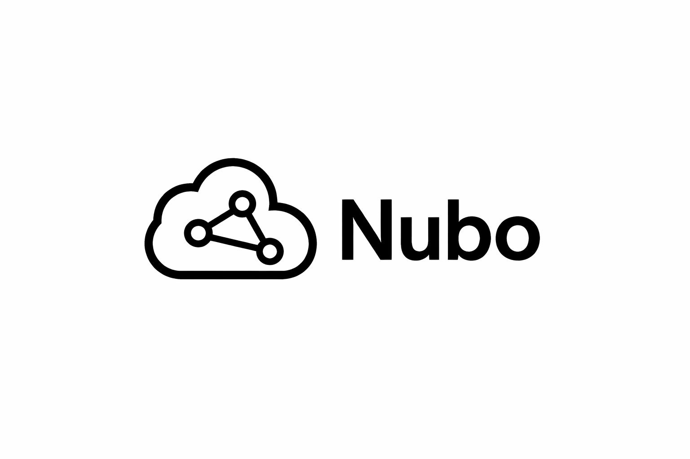

# 📌 Nubo — Project Specification

## 🧭 Project Vision

**Nubo** is a SaaS platform designed to centralize **team management, communication, and analytics** into a single, modern interface.

The goal is to create a system that is:
- **Fast and intuitive**
- **Visually distinctive**
- **Highly scalable**
- **Focused on real productivity**

---

## 🎯 Objectives

### Primary Goals
- Provide a **central hub** for team operations
- Deliver **real-time insights** through dashboards
- Enable **seamless communication**
- Ensure **excellent UX across all devices**

### Secondary Goals
- Create a **strong brand identity**
- Build a **modular and reusable codebase**
- Allow future integration with **AI and automation**

---

## 🧩 Core Modules

### 1. Dashboard (MVP)
**Status:** In Development

#### Features:
- KPI cards (revenue, activity, performance)
- Interactive charts (ApexCharts)
- Filters (date range, company, etc.)
- Responsive layout

#### Technical Notes:
- Data via PHP endpoints (`?ajax=charts`)
- Caching (APCu / file fallback)
- Avoid full page reloads

---

### 2. Authentication System
**Status:** MVP Ready

#### Features:
- Login page with animated UI
- Session-based authentication
- Form validation and feedback

#### UI Notes:
- Right-side animated canvas (logo formation)
- Clean, minimal layout

---

### 3. Communication (Sync)
**Status:** Planned

#### Features:
- Channels and direct messages
- Mentions (`@user`)
- Notification system (DM / Channel)
- Real-time updates

#### Integrations:
- talk.js (initial)
- Custom backend fallback

---

### 4. Team Management
**Status:** Planned

#### Features:
- User roles (ADMIN, CLIENTE, FUNCIONARIO)
- Permission system per module/page
- Activity logs

---

### 5. Scheduling / Agenda
**Status:** Planned

#### Features:
- Shared calendar
- Event creation/editing
- Conflict handling
- Visual timeline

---

## 🏗️ Architecture

### Pattern
- Modular structure (MVC-ready)
- Separation of concerns

### Layers
- **Frontend:** UI/UX (HTML, CSS, JS, Bootstrap)
- **Backend:** PHP controllers + APIs
- **Database:** MySQL (multi-tenant ready)
